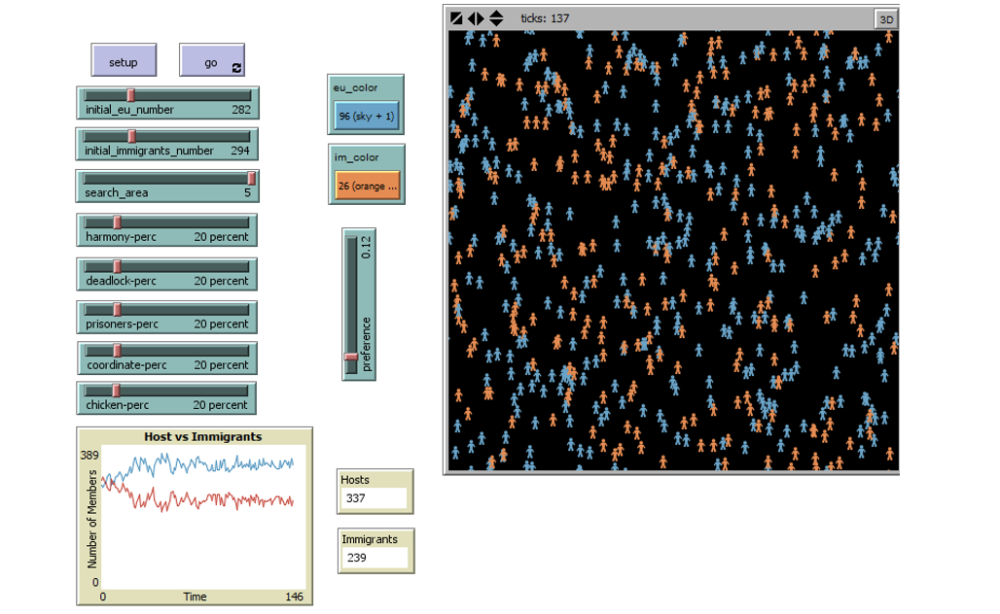
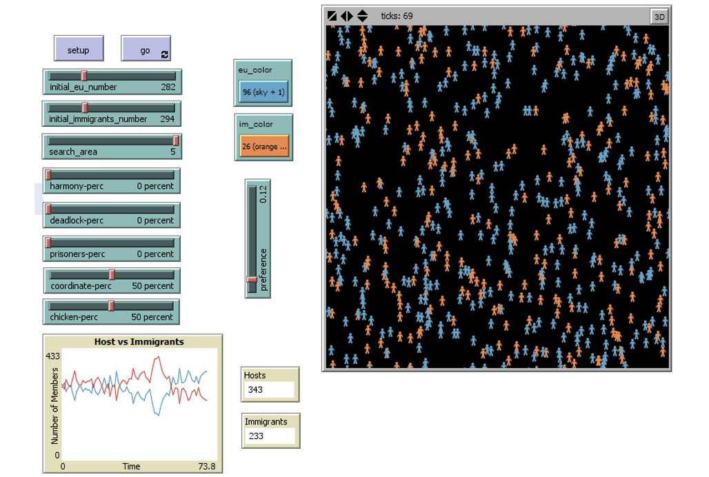
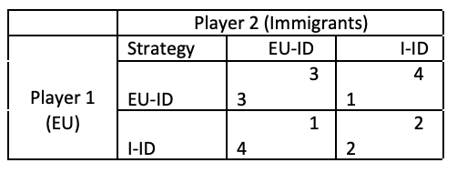
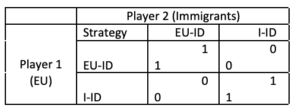
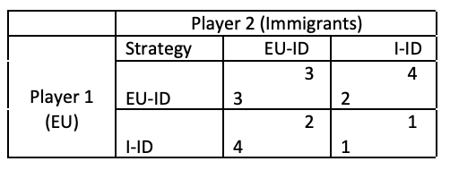

# Migration Game Theory

Current, world, news has displayed the mass amount of immigrants attempting to enter into Europe from the southern nations around Africa and the
Middle East. Many immigrants have been pardoned and allowed to enter the European nations, but there has been little or no discussion about the
lasting effects that meshing cultures could bring. It would not be fair to the Europeans or the immigrants to declare that only one culture may
survive, but is there a way to peacefully coexist? Will one culture inadvertently take over the other culture? The purpose of this project is to
use Agent Based Modeling and Simulation to study the possible effects of immigration into Europe from outside nations.

Mariaclara Ludovici authored a paper on the subject of the possible or probable effects of immigration into Europe in February 2016. She investigated
possible scenarios using Game theory techniques in her paper, but the goal of this application will be the use agent based modeling and simulation
to explore the issues from a different angle. The possible outcomes of the games proposed by Mariaclara will be explored. The agents in the sisimulation
 will have the ability to learn which game they like to play the most, and the game outcomes may be weighted by the percentage of the
population that supports a specific culture. The ability to learn and provide significant weights will distance this model from that of strict game theory.

# Interface Variable Descriptions

The model includes numerous interface variables that the user can alter in order to vary the execution outcomes. The first, and easiest, interface variables to alter (with no effect on the outcome) are the `eu_color` and `im_color`. The user can select the display colors for the agents in order to identify the agents. It is important, and obvious, to mention that the agents should be colored differently, and the agent colors should not be black (unless the background color is changed). 

The `initial_eu_number` is a slider that will indicate the number of agents, recognized as favoring the European culture, to be created when the setup procedure is executed. The `initial_immigrants_number` is a slider that will indicate the number of agents, recognized as favoring the immigrant culture, to be created when the setup procedure is executed. The search_area variable indicates how large the circle will be for an agent to search for another agent to play a game against. The smaller the search area, the less likely the agent will find an agent favoring the opposite culture. The preference slider indicates the amount that an agent will increase their preference for a particular game when they select that game. 

The `preference` variable is **very important**, because it allows the agents to adapt and favor certain games over others. Implicitly defined with the preference variable is a variable that subtracts one quarter of the preference value from each of the games percentage of being selected. Once a game has achieved a probability of 1.0, the game will be selected on each subsequent tick. 

The `harmony-prec` variable is the initial percentage of the time that the game will be chosen; it is the probability of selecting or using the harmony game. The deadlock-prec variable is the initial percentage of the time that the game will be chosen; it is the probability of selecting or using the deadlock game. The prisoners-prec variable is the initial percentage of the time that the game will be chosen; it is the probability of selecting or using the prisoner’s dilemma game. The coordinate-prec variable is the initial percentage of the time that the game will be chosen; it is the probability of selecting or using the coordination game. The chicken-prec variable is the initial percentage of the time that the game will be chosen; it is the probability of selecting or using the chicken game.

# Operating Instructions

If user does not like the color choices for the immigrants and Europeans, they can alter the colors for each agent using the two appropriate inputs. The user should select an appropriate number of European and immigrant agents using the sliders. The user can select a search area that they feel is appropriate for searching for other agents. It is advised that the user does not set the preference variable too high, because it will, essentially, eliminate the agent’s ability to learn. In order to draw the learning process out over a longer period of time, the preference variable should be set no higher than 0.20. Another important quirk about the model is that all of the percentages for the games must add up to 1.0 or the program will automatically redistribute the numbers to be 0.20 each. A warning will be generated when the user fails to properly set the values, but it should be mentioned before the user attempts this action. After all of the interface variables have been adjusted to meet the user’s requirements, click the setup button to run through the setup procedure. Proceed with the simulation by clicking the Go button to run the go procedure. It is important to note that there is no current case that will end the simulation, but this will be addressed below in the extending the model section. 

# Model Description and Technical Implementation

At the start of each tick, the agent set for each cultural preference is constructed. It is important to mention this feature, because, as one may be thinking, the agent could switch cultural preferences multiple times during a single tick. Exactly! As people do, the agents should be able to alter their cultural preference for each encounter with another agent whose cultural preference differs. The design consideration to query all of the agents and set them into agent sets at the beginning of each tick was also chosen to alleviate the computational power required and to decrease the runtime. The computational power decreases, because the query is run once instead of running once for each agent.

The agents will begin by wiggling or moving, to add variability and ensure that agents experience different encounters on each iteration. The agents will then move forward by 1 space using the move procedure. New behaviors may be experienced if certain agents are given the ability to move at different speeds or distances. 

All of the agents are asked to search for another agent that does not share the same cultural beliefs within the user defined search area (from the interface). The current agent will ask for one-of the agents that is both in their [user-defined] radius and that does not share their cultural preference. 

If another agent is found, then a game will be selected at random from a list of 5 predetermined games. The results of the games are predetermined from Mariaclara’s original report, and they are mentioned in the section directly below. The results can be any of the following: both agents support the European culture, both agents support the immigrant culture, or one agent supports one culture while the other agent supports the opposing culture. 

The prisoner’s dilemma and coordination games contain extra logic that will skew the end results by attempting to select the culture that is dominating the simulation at the current tick. After the results have been applied, the agent’s probabilities of choosing each type of game are updated. The agent is coded with the ability to adapt or choose only games that they have encountered most often.

# Agent Based Modeling vs. Game Theory 

Now the question that you may be wondering is, does agent based modeling and simulation offer a novel approach to this problem? The implementation, using agent based modeling and simulation, contains different features such as learning, adapting, and alternative scope from the game theory approach. 

The agent’s probabilities of choosing each game will be altered depending on the game that was currently chosen. The more often that a game is chosen, the more likely it will be chosen in the future. Once an agent’s probability of choosing a particular game reaches a value of zero, they will never be able to choose that game again; conversely the maximum probability of choosing any particular game is 1.0. 

The feature of adapting can be examined in the dual procedure. If the game that is selected is either the prisoner’s dilemma or the coordination game, then the agent’s cultural preference will be skewed by the percentage of the population that supports a particular culture. The agent is given the ability to be influenced by the other agents in the simulation. The ability to resist influence was simulated by randomly selecting a value and comparing it to the population percentage.

The agent based modeling and simulation approach has also taken the scope of the problem away from the game theory approach completely. The ABMS approach utilizes the two features described previously, which are dependent upon random values. Unlike most game theory techniques, there is no guaranteed solution to this problem and the results between simulation runs will never be identical (unless a random seed is used). The original game theory techniques simulated the possible outcomes of entire populations, while the ABMS approach simulates the games using individual players or agents.
 

# Experiments, Results, and Observations

User(s) should notice that no matter how many agents are added to the model, the number of agents favoring the host culture and the number of agents supporting the immigrant culture will always teeter around the fifty percent line if the percentages are left to the default 20 percent each. The theory is that this happens because of the balance of the results from the predetermined game theory results. In other words, the ability to learn and adapt may add more variability to the model, but their effects can be cancelled or neglected. The reason for this phenomenon is that the random numbers may lead each agent to favor one particular game. Since the results are balanced, then the agents may change their preference for a particular culture, but the chances are that for each agent that switches there is also an agent that reverses this effect. The slight teeter of the number of cultural supporters can be referred to as a negative or balancing feedback loop. 

Depending on the percentages, it is possible to observe each culture completely take over and control the population. This result is most likely due to the ability to adapt. If one culture starts to take over and the number of people favoring that culture grows too large, then the games will favor that particular culture. This creates a positive or reinforcing loop in the simulation. 

Try moving the sliders that initialize the model with different numbers of agents including the initial immigrants and European numbers. The search area can be adjusted while the model is executing, but the runtime alterations do not appear to greatly affect the model. In order for the results to be noticed as the search area is altered, try setting the initial immigrants and European numbers very low. The user may also wish to slow down the execution speed in order to be sure to notice the differences. 

Try altering the percentages in order to observe different scenarios. It is important to note that the user will also see different results even leaving all of the values the same between different runs of the simulation. 

As mentioned previously, it is advised that the user alter the preference variable, but please be cautious. A very high value for the preference will lead to the agents finalizing their favorite game very quickly. In fact, when the preference is set too high the number of agents supporting each culture will only change slightly with no true growth or decay. After testing the model, it was  decided that a value of 0.20 or lower should be used as the preference value to ensure that the agent does not find a favorite game too quickly. 

The image below shows the results of running the model with all of the probabilities set to an initial value of 0.20 and the preference set to 0.12. The graph in the bottom left corner indicates that the Host or EU culture will take over. It is interesting to note that the initial number of agents supporting each culture is relatively even, but the EU culture quickly takes over. The nature of the graph leads us to believe that the prisoner’s dilemma, harmony, and coordination game are selected most often in this early period. The harmony game will ensure that both players favor the EU culture. The results of the Prisoner’s Dilemma and Coordination games favor the culture that is currently dominating the simulation.	

The image below displays a simulation run with only the coordination and chicken games selected. The simulation run was a little more interesting than most of the simulation runs. In the majority of the simulations, there were possible crosses in the graph for the number of immigrant and EU supporters. In this particular run, the normal majority culture switches, but it is interesting to see how large the separation can become and still be able to switch. The largest separation occurs around tick 45, but the EU culture is able to recover.

The results of the simulation indicate that it is possible for both cultures to coexist without one culture overtaking the other culture. In certain scenarios, the culture that starts with a significant advantage over the other, will quickly take over and it will become impossible for the other culture to advance or recover. Conversely, the simulation runs indicate that it is possible to start with as little as one agent and the culture can grow; the culture can reach an achievement of about fifty percent of the population. The purpose of the model was not to predict the future, instead the purpose was to explore the possible scenarios that can occur. The model was successful in determining and conveying the possible scenarios that could develop from conflicting cultures. 

# Suggested methods of extending the model

There are several ways that the user can extend the model or alter the way that the model executes. The first and easiest extension is to modify the move procedure so that the agents can take in different values for the forward command. Once the procedure has been altered, further modify the model by sending in values to the function for different agent sets. It can be a simple entry to successful model extensions. Observe and report and changes from running the simulation in this manner. It is important to note that the user must run a lot of iterations in order to grasp true changes, because the model is based on random numbers thus no iteration will be exactly the same (even with no variable alterations).

The second extension of the model is that the user can alter the number of preset game theory techniques by rearranging the order or decrementing the number of possible techniques. The extension is listed before several others, because this will take the far less time to accomplish and it will have the least total impact on the current code. The user can make simple changes to the code by commenting specific sections out or altering a single number. 

The third model extension is the addition of new game theory techniques. In fact, there is a comment in the code for the dual procedure that indicates where the new techniques may be added. The user must know all of the possible Nash Equilibrium points in the game, or, if there are not any equilibrium points, the possible solutions to the game. The extension seems rather simple at first glance, but an additional game will require the addition of code to the adjust and random-game procedures. The user will also be forced to change the error checking code in the setup procedure, and add a new slider to the interface tab. 

The fourth and final extension is the addition of a termination case. In the event that a user would like to run multiple iterations of the model, a proper termination case should be established. The user should add a measure of the average number of agents supporting each culture for a given amount of time. For example, keep track of the numbers over a period of 100 ticks. If the average number of supporters for the European culture is within a tolerance level of the current value, then the simulation has reached a steady state. 

# Similar Models

All Prisoner’s Dilemma models under the Social Science portion of the model library were considered to be similar to the model. The prisoner’s dilemma models were considered to be helpful in the development of the model. The prisoner’s dilemma models were advantageous to study, because they allowed us to examine the possible solutions based on rational human behavior. 

The segregation models are also an important set of models that were considered to be similar to this model. These models are related, because the model uses the idea that people want to be near people with the same characteristics. This feature was described as the adaptability feature of the model. The agents’ results of their game will be skewed by percentage of the population that supports a particular culture. 

# Games

## Harmony 

Under the context of immigration into the EU it is interesting to consider the game of _Harmony_, shown below. In this condition, cooperating is the best solution and best rational outcome for both agents, because the Harmony Game maximizes the payoffs that correspond to the same strategies for each player. When both agents opt to adopt or keep the EU culture, they will each have the highest payoff value; this strategy is known as the dominant strategy. 

## Deadlock

In the game of _Deadlock_ the situation is the exact opposite of the Harmony (above); opting to adopt the immigrant culture will earn the highest payoff for both agents (Büthe). Shown below, one can notice how the bottom right corner of the grid will earn both players the highest payoff. Similar to the Harmony game, a dominant strategy arises. A dominant strategy is present when each player chooses the choice for themselves that will have the highest possible outcome.

## Prisoner's Dilemma

The _Prisoner's Dilemma_ game leads both pleyers to attempt to maximize their own payoffs with no cooperation. In the image below, one can notice that there is no dominant strategy (_Nash Equilibrium_) in the Prisoner’s Dilemma. The outcome of the agent that defect is dependent upon the proportion of the population that supports each culture. 

## Coordination

The players will align their beliefs to support either the EU or immigrant culture. The manner in which this solution is simulation is similar to that of the prisoner’s dilemma. A random number is selected based on the proportion of the population that favors a particular culture. The dominant culture is more likely to gain the support of the two players from this game. 

## Chicken

In the game of _Chicken_ as one player chooses EU cultural preference, the other agent will in turn support the immigrant culture. A number is randomly selected from a uniform distribution. If the number is less than one half the current agent will support the EU culture, while the target agent will support the immigrant culture. The opposite will remain true when the random number is above 0.5. 

# Model Assumptions

The strongest and most important assumption in the model is rational behavior. All of the outcomes or results for the games that were played or simulated were based on the rational behavior of human agents. The basis for this assumption is two-part. First, the assumption alleviates the need to code all possible outcomes, thus allowing the scope to drift away from the game theory approach. The second reason that we made this assumption is based on the fact over a large number of iterations, a real human would learn and choose the answers that we have explicitly coded into the model. 
